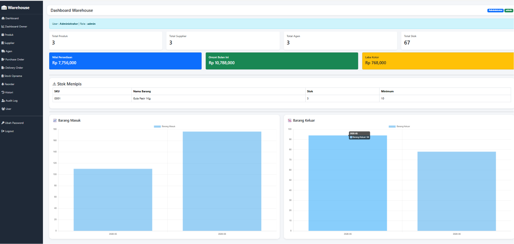
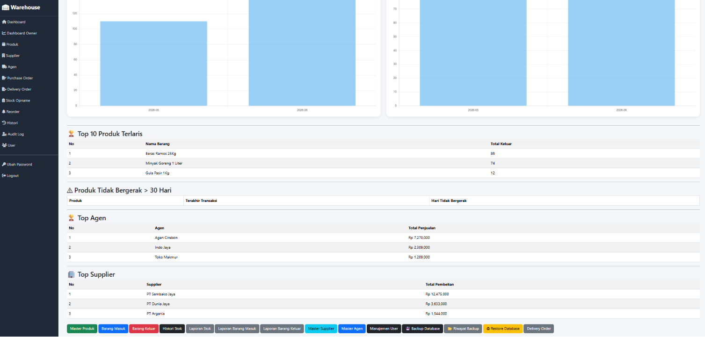
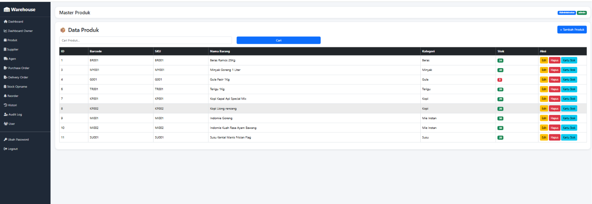
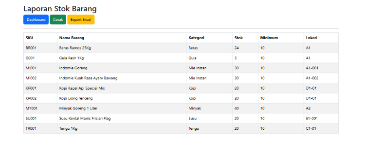

# Warehouse Management System

A web-based Warehouse Management System developed using Python Flask to help businesses manage inventory, suppliers, stock movements, and operational reporting.

---

## Overview

This application was developed to simplify warehouse operations through centralized inventory management and business reporting.

The system provides tools for tracking stock levels, monitoring inventory movement, managing suppliers and agents, generating reports, and maintaining audit logs.

---

## Features

### Authentication & User Management

- Login System
- Role-Based Access Control
- User Management
- Change Password

### Inventory Management

- Product Management
- Supplier Management
- Agent Management
- Stock Monitoring
- Inventory Valuation

### Warehouse Operations

- Purchase Order
- Delivery Order
- Stock Opname
- Reorder Monitoring
- Stock History

### Reporting & Analytics

- Revenue Dashboard
- Profit Dashboard
- Top Selling Products
- Top Suppliers
- Top Agents
- Low Stock Alerts

### System Utilities

- Audit Log
- Database Backup
- Database Restore
- Excel Export

---

## Technology Stack

| Technology | Usage |
|------------|--------|
| Python | Backend Development |
| Flask | Web Framework |
| SQLite / MySQL | Database |
| Bootstrap 5 | User Interface |
| HTML5 | Frontend |
| CSS3 | Styling |
| JavaScript | Client Side |
| Chart.js | Dashboard Analytics |

---

## Screenshots

### Dashboard




### Product Management



### Stock Report



---

## Project Structure

```text
warehouse-management-system/
│
├── app.py
├── config.py
├── requirements.txt
├── README.md
│
├── templates/
├── screenshots/
├── backup/
└── restore/
```

---

## Future Improvements

- REST API Integration
- Multi Warehouse Support
- Barcode Scanner Integration
- Purchase Approval Workflow
- Mobile Responsive Optimization

---

## Developer

Danu Setiawan

Python Backend Developer

Bogor, Indonesia
